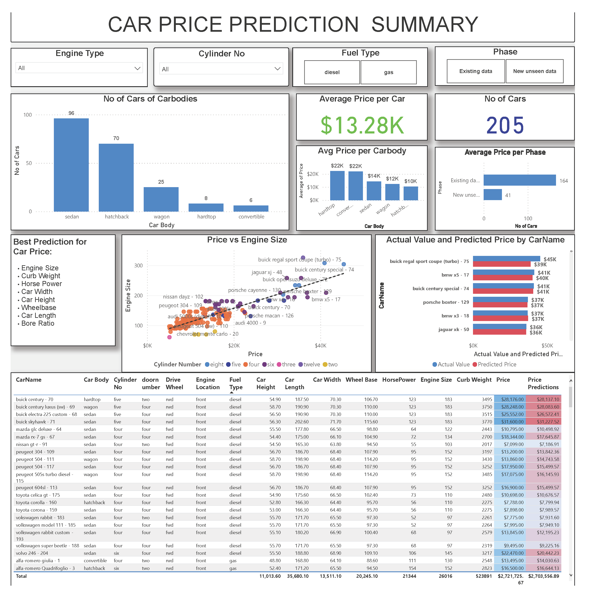

# Car Price Prediction
I have created a mock SQL DB for US car registrations and their owners. I created the SQL DB through the CarRegistrationsTableCreation.sql file and then populated that database through the Program.cs file and supporting .txt files. 

